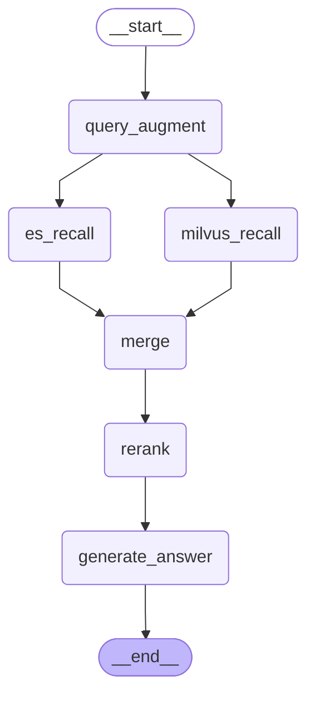

# Hybrid RAG 检索增强生成架构

> 基于 LangGraph 搭建的混合检索流水线：多角度查询改写 → 双路召回 → 精排 → 生成。

---

## 流程图



---

## 节点详解

### 1. query_augment — 查询扩写

**输入：** 用户原始问题（`state.query`）

**逻辑：**
- 调用大模型（withStructuredOutput + Zod 校验）将原问题改写为 **恰好 3 条** 不同角度的检索问句。
- 每条问句与原意一致，但换角度/换说法/加限定词，专有名词、订单号、型号等保留原样。
- 兜底：若 LLM 输出不合法，用原问题补足 3 条。

**输出：** `state.queryAugmentation = { queries: [q1, q2, q3] }`

**相关文件：** [query-augment.mjs](query-augment.mjs)

```js
const queries = retrievalQueryStrings(original, augmentation);
// → [original, q1, q2, q3] 共 4 条检索串
```

---

### 2. es_recall — Elasticsearch 向量/关键词检索

**输入：** `state.query` + `state.queryAugmentation`

**逻辑：**
- 对 **每条** 检索串分别对 ES 发起 `multi_match` 查询（`best_fields` 模式 + ik_smart 中文分词）。
- 加权字段：`note_title^2`（标题权重×2）、`note_body`、`title`、`content`。
- 每串取 top-K，总期望召回 15 条，均分到各串（最少每条 2 条）。
- 按 `metadata.id` **去重**（首次出现优先，ES 检索串排在 Milvus 前）。

**输出：** `state.esHits = Document[]`

| 参数 | 值 |
|------|-----|
| Index | `life_notes` |
| 字段加权 | `note_title^2`, `note_body`, `title`, `content` |
| 匹配模式 | `best_fields` |
| 分词器 | `ik_smart` |
| 总目标 K | 15 |

---

### 3. milvus_recall — Milvus 向量语义检索

**输入：** `state.query` + `state.queryAugmentation`

**逻辑：**
- 对 **每条** 检索串分别对 Milvus 发起 `similaritySearch`（向量语义检索）。
- Embedding 模型：`text-embedding-v3`（阿里云 DashScope 兼容模式）。
- 每串取 top-K，总期望召回 15 条，均分到各串（最少每条 2 条）。
- 按 `metadata.id` 去重。

**输出：** `state.milvusHits = Document[]`

| 参数 | 值 |
|------|-----|
| Embedding 模型 | `text-embedding-v3` |
| Embedding API | `https://dashscope.aliyuncs.com/compatible-mode/v1` |
| Milvus 地址 | `localhost:19530` |
| Collection | `life_notes` |
| 文本字段 | `doc_text` |
| 向量字段 | `embedding` |
| 总目标 K | 15 |

---

### 4. merge — 双路合并 + 去重

**输入：** `state.esHits` + `state.milvusHits`

**逻辑：**
- 两路结果拼接，ES 结果在前，Milvus 在后。
- 按 `metadata.id` 去重（`id` 为空的条目丢弃），保留首次出现。
- 不做正文相似度去重，不跨路合并排序。

**输出：** `state.merged = Document[]`

```js
// 合并策略
function merge(esDocs, milvusDocs) {
  const combined = [...(esDocs ?? []), ...(milvusDocs ?? [])]
    .filter((d) => d?.pageContent);
  return dedupeDocsById(combined);
}
```

---

### 5. rerank — 精排重排

**输入：** `state.merged` + `state.query`

**逻辑：**
- 调用 DashScope Rerank 模型（`qwen3-rerank`）对合并后的文档列表按 query 相关性重排序。
- `topN = 3`：仅保留最相关的 3 条文档送入生成阶段。
- 若合并列表为空，直接跳过，`topDocuments` 置空。

**输出：** `state.topDocuments = Document[]`（最多 3 条）

| 参数 | 值 |
|------|-----|
| Rerank 模型 | `qwen3-rerank` |
| topN | 3 |
| API | DashScope / 自定义 `RERANK_URL` |

---

### 6. generate_answer — 大模型生成回答

**输入：** `state.query` + `state.topDocuments`

**逻辑：**
- **有上下文**：将 topDocuments 格式化为带编号、id、来源的片段列表，拼接至 prompt 作为上下文，LLM 据此作答。
- **无上下文**：使用单独 prompt，礼貌告知用户「笔记内未找到相关信息」，请用户换种说法。

**规则：**
- 只根据检索片段推断，不编造。
- 若片段不足以回答，明确说明「笔记里未提到」。
- 回答简洁、有条理，口吻自然中文。

**输出：** `state.answer = string`

---

## 状态流转图

| Step | 读取 | 写入 |
|------|------|------|
| `query_augment` | `query` | `queryAugmentation` |
| `es_recall` | `query`, `queryAugmentation` | `esHits` |
| `milvus_recall` | `query`, `queryAugmentation` | `milvusHits` |
| `merge` | `esHits`, `milvusHits` | `merged` |
| `rerank` | `merged`, `query` | `topDocuments` |
| `generate_answer` | `query`, `topDocuments` | `answer` |

---

## 关键设计决策

1. **多角度查询改写**：单一用户问题可能遗漏语义维度（如"无线老断"可同时搜索"掉线"、"WiFi 不稳定"、"路由器"），LLM 扩写提高了召回覆盖面。

2. **双路检索互补**：
   - ES `multi_match` + ik 分词 → 关键词精确匹配，适合型号、订单号、品牌等字面信息。
   - Milvus 向量检索 → 语义相似匹配，适合同义改写、口语化表达。

3. **ES 优先于 Milvus**：合并时 ES 结果在前，相同 id 保留 ES 的正文（通常更完整）。

4. **重排保精度**：双路召回后可能引入噪声，用专门 Rerank 模型压缩到 top-3，减少 LLM 上下文噪声。

5. **LangGraph 状态管理**：每个节点读写 `HybridRetrievalState` 的特定字段，并行节点（es_recall / milvus_recall）互不依赖，自动并发执行。

---

## 运行方式

```bash
# 需配置环境变量
# OPENAI_API_KEY / OPENAI_API_EMBDDING_KEY / DASHSCOPE_API_KEY / MODEL_NAME / OPENAI_BASE_URL / RERANK_URL

node es-test/src/rag/hybrid-retrieval.mjs
```

示例输出会依次打印：
- Mermaid 流程图
- 每条 query 的：查询改写结果 → ES 命中 → Milvus 命中 → 重排结果 → 最终回答
