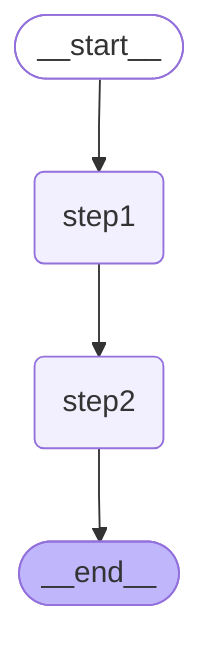
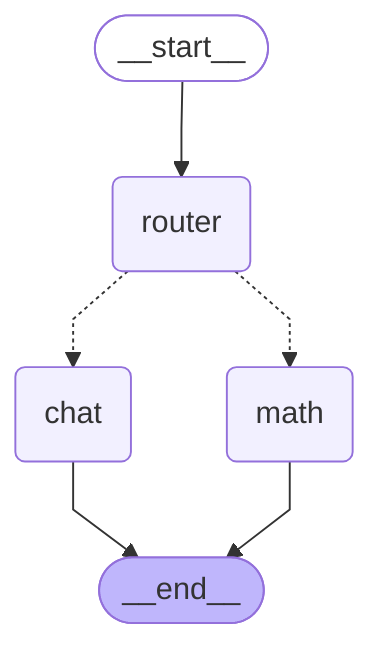
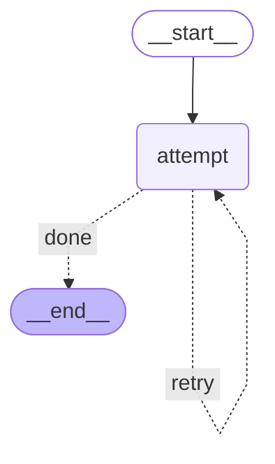
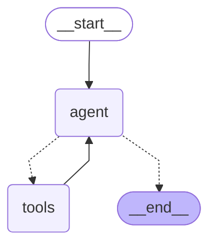
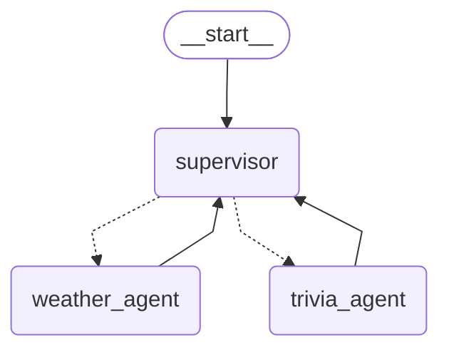

# LangGraph 基础示例 — 流程图

## 流程说明

| 步骤 | 说明 |
|------|------|
| `__start__` | 图入口节点 |
| `step1` | 在 `state.text` 末尾追加 `"=> step1"` |
| `step2` | 在 `state.text` 末尾追加 `"=> step2"` |
| `__end__` | 图终点节点 |

执行顺序：`__start__ → step1 → step2 → __end__`，最终返回 `{ text: "hello=> step1=> step2" }`。

---

# 条件路由示例 — 流程图

## 流程说明

| 步骤 | 说明 |
|------|------|
| `__start__` | 图入口节点 |
| `router` | 检查 `state.query` 是否含运算符 `+ - * /`，设置 `route = "math"` 或 `"chat"` |
| `math` | 用 `eval` 执行数学表达式，返回计算结果 |
| `chat` | 原样回显用户输入 |
| `__end__` | 图终点节点 |

判断逻辑：`query` 含 `+ - * /` → 走 `math`，否则走 `chat`

---

# 循环重试示例 — 流程图

## 流程说明

| 步骤 | 说明 |
|------|------|
| `__start__` | 图入口节点 |
| `attempt` | 每次 `tries + 1`，满 3 次才标记成功 |
| `__end__` | 图终点节点 |

关键：`attempt` 的条件边指向**自己**（`retry` 标签），形成循环重试，直到成功才走 `done` 到终点。

---

# Agent + Tools 循环 — 流程图

## 流程说明

| 步骤 | 说明 |
|------|------|
| `__start__` | 图入口 |
| `agent` | 判断是否需要调用工具，需要则走 `tools`，否则结束 |
| `tools` | 执行工具调用（如查库存），结果返回给 `agent` 继续判断 |
| `__end__` | 终点 |

关键：`agent <──> tools` 形成循环，agent 觉得够了才走到终点。

---

# Supervisor + 多 Agent — 流程图

## 流程说明

| 步骤 | 说明 |
|------|------|
| `__start__` | 图入口 |
| `supervisor` | 调度员：判断用户问的是天气还是小知识，分配给对应子代理 |
| `weather_agent` | 查天气的子代理 |
| `trivia_agent` | 讲城市小知识的子代理 |
| `__end__` | 终点 |

关键：子代理执行完后 **回到 supervisor**，由 supervisor 决定下一步派谁，或者汇总结果结束。
