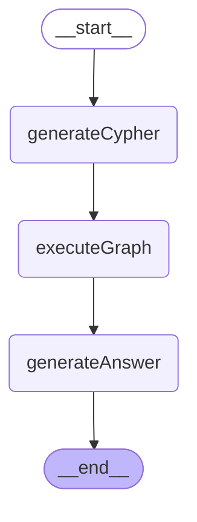

# GraphRAG 工作流

## 流程图



## 节点说明

| 节点 | 作用 |
|------|------|
| `generateCypher` | 根据用户问题，用大模型生成 Neo4j Cypher 查询语句 |
| `executeGraph` | 执行 Cypher 查询，从 Neo4j 图数据库检索数据 |
| `generateAnswer` | 将检索结果作为上下文，用大模型生成自然语言回答 |

## 数据流

```
用户提问
  ↓
generateCypher → 生成 Cypher 语句
  ↓
executeGraph  → 从 Neo4j 查询数据
  ↓
generateAnswer → 合成最终回答
  ↓
输出答案
```
